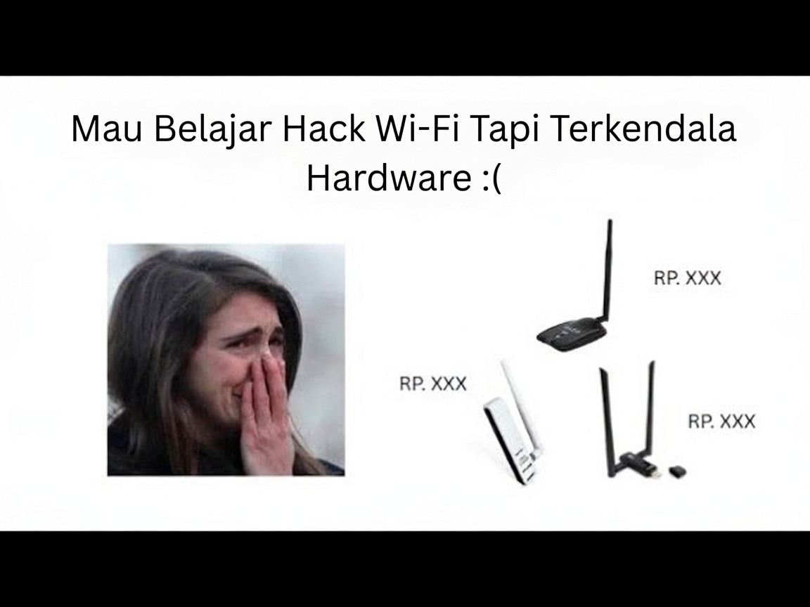

# lab-wifi



Virtual lab for wireless hacking simulation using [mac80211_hwsim](https://www.kernel.org/doc/html/v6.9/networking/mac80211_hwsim/mac80211_hwsim.html).

## Requirements

- Kali Linux 2026.1+
- Root access (`sudo`)

## Setup Lab

```bash
sudo apt update
sudo apt install -y hostapd dnsmasq wpasupplicant isc-dhcp-client aircrack-ng iw macchanger network-manager iproute2 openssl git
git clone https://github.com/fixploit03/lab-wifi
cd lab-wifi
```

## Install Tools (optional)

```bash
sudo apt install -y kali-tools-802-11 kali-tools-wireless
```

## Usage

```bash
sudo ./lab-wifi.sh start   # start the lab
sudo ./lab-wifi.sh stop    # stop the lab
```
  
## License

[MIT](LICENSE) - Rofi (Fixploit03)
